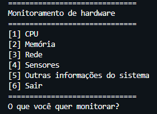

# Hardware Monitoring

Sistema desenvolvido para a aula de cálculo computacional em python para fazer o monitoramento do hardware da máquina utilizando a biblioteca psutil

# Tecnologias utilizadas

## Screenshots

# Funcionalidades

- Acesso aos dados da memória RAM e do HD
- Acesso aos dados do sensor da bateria
- Acesso a lista de usuários cadastrados na máquina
- Acesso ao tempo de processamento da CPU

## Autores

- [@KauanCavazani](https://www.github.com/KauanCavazani)